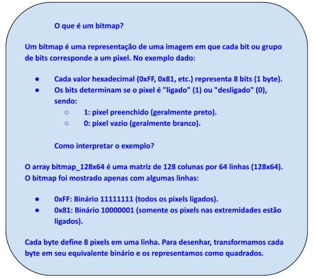

## Configurando e Usando o Display OLED da BitDogLab

<p align="center">
  
</p>

## Autores

- [Aryelson Gonçalves](https://github.com/aryelson1)  

- [Guilherme Santos](https://github.com/GuilhermexL)  

---

## Objetivo

Neste projeto, vamos configurar e programar o Display OLED da BitDogLab utilizando a linguagem C. O objetivo é criar um programa que inicialize o display, configure os parâmetros de operação e exiba uma mensagem personalizada. O programa deve:
- Inicializar a comunicação com o display.
- Configurar os parâmetros de operação.
- Atualizar a tela com a mensagem desejada.

---

## Arquitetura do Projeto


1. Hardware Utilizado

- 1x Placa BitDogLab
- Display_oled

2. Conexões

- I2C_SDA: Pino GPIO14
- I2C_SCL: Pino GPIO15

---

## Funcionalidades

### `display_init()`

- [ ] **Descrição:** Inicializa o display e a comunicação I2C.
- [ ] **Detalhes:**
  - Configura os pinos SDA e SCL para comunicação I2C.
  - Inicializa o display OLED SSD1306.
  - Calcula o tamanho do buffer da área de renderização.


### `display_clear()`

- [ ] **Descrição:** Limpa o display preenchendo o buffer com zeros.
- [ ] **Detalhes:**
  - Zera todos os pixels do buffer.
  - Atualiza o display com o buffer limpo
  - Calcula o tamanho do buffer da área de renderização.

### `display_render()`

- [ ] **Descrição:** Renderiza o buffer atual no display.
- [ ] **Detalhes:**
  - Atualiza o display com o conteúdo atual do buffer de pixels.

### `draw_rectangle(int x0, int y0, int x1, int y1, bool filled, bool set)`

- [ ] **Descrição:** Desenha um retângulo na tela, podendo ser preenchido ou apenas o contorno.
- [ ] **Detalhes:**
  - Se filled for verdadeiro, preenche o retângulo com pixels.
  - Se filled for falso, desenha apenas o contorno do retângulo.
  - Define cada pixel dentro do retângulo ou apenas as bordas, dependendo do parâmetro filled.

### `test_display_pixels()`

- [ ] **Descrição:** Testa a exibição de pixels no display.
- [ ] **Detalhes:**
  - Acende cada pixel do display sequencialmente.
  - Atualiza o display após cada pixel ser aceso.
  - Exibe uma matriz de pixels no console para depuração.

### `print_text_display(char *text[], uint count)`

- [ ] **Descrição:** Exibe um array de strings no display.
- [ ] **Detalhes:**
  - Escreve cada linha de texto no display, avançando a posição vertical a cada linha.
  - Atualiza o display após cada linha ser escrita.

### `print_image_display(uint8_t bitmap_128x64[])`

- [ ] **Descrição:** Exibe uma imagem no display.
- [ ] **Detalhes:**
  - Renderiza um bitmap de 128x64 pixels na tela.
  - Utiliza a função ssd1306_draw_bitmap para desenhar a imagem.

### `draw_circle(int x0, int y0, int radius, bool set)`

- [ ] **Descrição:** Desenha um círculo usando o algoritmo de Bresenham.
- [ ] **Detalhes:**
  - Desenha 8 pixels simétricos para formar o círculo.
  - Atualiza as coordenadas e o erro para desenhar o círculo de forma eficiente.

---

## Desenvolvimento

### Passo 1: Configuração do Ambiente

Antes de iniciar a programação, certifique-se de que o ambiente de desenvolvimento está configurado:

- Conecte a BitDogLab ao computador utilizando um cabo USB.
- Abra o VS Code e carregue o projeto com a estrutura de pastas para compilar e executar código em C na BitDogLab.
- Verifique se as bibliotecas necessárias estão instaladas:
  - **ssd1306.h**: Para reconhecer as funções do código C. [Link](https://github.com/BitDogLab/BitDogLab-C/blob/main/display_oled/inc/ssd1306.h).
  - **ssd1306_font.h**: Para obter os desenhos no display para cada caractere. [Link](https://github.com/BitDogLab/BitDogLab-C/blob/main/display_oled/inc/ssd1306_font.h).
  - **ssd1306_i2c.h**: Para controlar o Display OLED. [Link](https://github.com/BitDogLab/BitDogLab-C/blob/main/display_oled/inc/ssd1306_i2c.h).
  - **ssd1306_i2c.c**: Para declarar as funções ativas do código C. [Link](https://github.com/BitDogLab/BitDogLab-C/blob/main/display_oled/inc/ssd1306_i2c.c).
  - Inclua os arquivos `ssd1306.h`, `ssd1306_font.h`, `ssd1306_i2c.h` e `ssd1306_i2c.c` em uma pasta chamada `inc` dentro do projeto.
  - Instale os drivers para comunicação I2C.

---

### Passo 2: Entendimento da Configuração do Hardware

- O Display OLED está conectado ao barramento I2C da BitDogLab através dos seguintes pinos:
  - **SDA**: GPIO14
  - **SCL**: GPIO15
- O endereço do Display OLED é **0x3C**.

---

### Passo 3: Escrevendo o Código

#### Inicialização do I2C e do Display OLED

Inclua as bibliotecas necessárias e inicialize a comunicação com o display:

```c
#include <stdio.h>
#include <string.h>
#include <stdlib.h>
#include <ctype.h>
#include "pico/stdlib.h"
#include "pico/binary_info.h"
#include "inc/ssd1306.h"
#include "hardware/i2c.h"
#include "inc/display.h"
#include "tests/display_test.h"

int main()
{

	display_init();
  display_clear();

  while (true)
  {
  		sleep_ms(1000);
  }

	return 0;

}

```

#### Exibição de Mensagem no Display

Função para escrever texto no Display OLED (no arquivo `display.c`) e chame-a no código principal:

```c

// Exibe um array de strings no display
void print_text_display(char *text[], uint count)
{
    int y = 0;
    for (uint i = 0; i < count; i++)
    {
        ssd1306_draw_string(ssd, 5, y, text[i]); // Escreve cada linha de texto
        y += 10; // Avança a posição vertical
        display_render(); // Atualiza o display
    }
}

```

```c
    char *text[] = {
        "  Bem-vindos!   ",
        "  VIRTUS CC   "};

    uint count = sizeof(messages) / sizeof(messages[0]);
    print_text_display(text, count);


    while(true) {
        sleep_ms(1000);
    }

    return 0;
}
```
---

### Passo 4: Compilação e Execução

- Compile o código no VS Code.
- Carregue o programa na BitDogLab.
- Observe a mensagem "Bem-vindos!" e "VIRTUS CC" no Display OLED.

---

## Exploração Adicional

- Modifique a mensagem para exibir seu nome ou outro texto personalizado.
- Experimente mudar a posição do texto no display ajustando os valores de `x` e `y`.
- Tente adicionar animações simples, como rolagem de texto ou texto piscando.

---

## Dica Importante

Sempre chame a função `display_render();` após modificar o buffer do display para garantir que as alterações sejam exibidas.

---

## Desenhando Linhas no Display OLED da BitDogLab com o Algoritmo de Bresenham

Nesta atividade, exploraremos como desenhar linhas no Display OLED da BitDogLab utilizando a linguagem C. Para isso, aplicaremos o algoritmo de Bresenham, amplamente usado em sistemas gráficos por sua eficiência no cálculo de pontos de uma linha reta.

### Objetivo

- Compreender como um algoritmo pode ser implementado para trabalhar com gráficos baseados em pixels.
- Aprender a manipular pixels no Display OLED.
- Estimular o raciocínio matemático aplicado à programação.

---

### Desenvolvimento

## Exibindo Bitmaps no Display OLED da BitDogLab

Exibir uma imagem monocromática no Display OLED presente na BitDogLab. As imagens serão importadas como bitmaps no formato 128x64, adequado para a resolução do display.

---

#### Passo 1: Converter a Imagem para Bitmap

- Use uma ferramenta gráfica (como [image2cpp](https://javl.github.io/image2cpp/) ou um conversor online) para criar ou editar uma imagem de 128x64 pixels.
- Exporte a imagem no formato monocromático (1-bit, preto e branco) e salve-a como uma matriz de bytes.
- O resultado será uma matriz de bytes em formato hexadecimal, onde cada bit representa um pixel (1 para ligado, 0 para desligado).

Exemplo de matriz de bitmap (imagem simples):

```c
const uint8_t bitmap_128x64[] = {
    0xFF, 0x81, 0x81, 0xFF,  // Padrão de quadrado (exemplo)
    0x81, 0x81, 0x81, 0xFF,  // Continuação do padrão
    // Adicione mais linhas para completar 128x64
};
```



---

#### Passo 2: Código para Renderizar o Bitmap no Display OLED

- Função para Desenhar o Bitmap – Crie uma função que copie os dados do bitmap para o buffer do display.

```c
void ssd1306_draw_bitmap(ssd1306_t *ssd, const uint8_t *bitmap) {
    // Copia o bitmap para o buffer do display
    for (int i = 0; i < ssd->bufsize - 1; i++) {
        ssd->ram_buffer[i + 1] = bitmap[i]; // O buffer começa no índice 1
    }
    // Atualiza o display com os dados do buffer
    ssd1306_send_data(ssd);
}
```

- Programa Principal – Use a função `ssd1306_draw_bitmap` para carregar e exibir o bitmap no display.

```c
#include <stdio.h>
#include <string.h>
#include <stdlib.h>
#include <ctype.h>
#include "pico/stdlib.h"
#include "pico/binary_info.h"
#include "inc/ssd1306.h"
#include "hardware/i2c.h"
#include "inc/display.h"
#include "tests/display_test.h"


int main()
{
   	display_init();
    display_clear();

restart:

    const uint8_t bitmap_128x64[] = {
        0xFF, 0x81, 0x81, 0xFF,  // Padrão de quadrado (exemplo)
        0x81, 0x81, 0x81, 0xFF,  // Continuação do padrão
        // Adicione mais linhas para completar 128x64
        };

    ssd1306_t ssd_bm;
    ssd1306_init_bm(&ssd_bm, 128, 64, false, 0x3C, i2c1);
    ssd1306_config(&ssd_bm);

    ssd1306_draw_bitmap(&ssd_bm, bitmap_128x64);

    while(true) {
        sleep_ms(1000);
    }

    return 0;
}
```
---

#### Passo 3: Como Testar

- **Visual Studio Code** (ou outra IDE compatível)
- **Extensão Raspberry Pi Pico** (para desenvolvimento com Raspberry Pi Pico)
- **Raspberry Pi Pico SDK** (versão 1.5.1)
- Verifique a Imagem: A imagem definida no `bitmap_128x64` será exibida no Display OLED.

---

## Casos de Teste Adicionados
Foram implementados os seguintes casos de teste para validar as funcionalidades do display:

- Exibição de Texto:

  - Exibe três mensagens no display:

    ```c
    "Bem Vindo,Vamos "
    "Iniciar O Teste"
    "da Biblioteca. "
    ```
  - Aguarda 2 segundos antes de prosseguir.

- Desenho de Retângulos:

  - Desenha um retângulo grande (117x53 pixels) no centro do display.

  - Desenha quatro retângulos menores nos cantos do display.

  - Aguarda 2 segundos entre cada etapa.

- Desenho de Círculos:

  - Desenha um círculo grande no centro do display.
  
  - Desenha quatro círculos menores nos cantos do display.
  
  - Aguarda 2 segundos entre cada etapa.

- Combinação de Retângulos e Círculos:

  - Desenha quatro retângulos nos cantos e um círculo no centro do display.
  
  - Aguarda 2 segundos antes de prosseguir.

- Renderização de Bitmap:

  - Renderiza um bitmap de 128x64 pixels no display.
  
  - Aguarda 5 segundos para visualização.

- Finalização:

  - Exibe a mensagem "Teste Finalizado." no display.
  
  - Aguarda 2 segundos antes de reiniciar o teste.

---

## Dicas Adicionais

- **Ferramenta para Gerar Bitmaps**:
  - Use o GIMP:
    - Crie uma imagem de 128x64 pixels.
    - Exporta como `.xbm` (C header file). O GIMP gera automaticamente um array de bytes para incluir no código.
- **Formato de tamanho**:
  - Certifique-se de que o tamanho do array seja exatamente 128x64 / 8 = 1024 bytes.

---

## Exploração Adicional

- Combine a exibição de bitmaps com outras funções, como desenhar texto ou linhas, para criar interfaces gráficas dinâmicas.
- Com isso, você terá uma forma eficiente de exibir bitmaps no Display OLED da BitDogLab usando C!

Aqui está a **Conclusão** para o seu README:

---

## Conclusão

Este projeto demonstra como configurar e utilizar o Display OLED da BitDogLab com a linguagem C, explorando funcionalidades como exibição de texto, desenho de linhas, quadrados, circulos e renderização de bitmaps. Através dessas funções, foi possível compreender os fundamentos da comunicação I2C, manipulação de gráficos em dispositivos embarcados e a integração de hardware e software para criar interfaces visuais simples e eficientes.

As técnicas apresentadas podem ser expandidas para projetos mais complexos, como a criação de menus interativos, exibição de gráficos dinâmicos ou integração com sensores e outros periféricos. O Display OLED, com sua resolução de 128x64 pixels, oferece uma plataforma versátil para aplicações que exigem feedback visual em sistemas embarcados.

Com isso, você está preparado para explorar novas possibilidades e implementar soluções criativas utilizando o Display OLED da BitDogLab!

---
